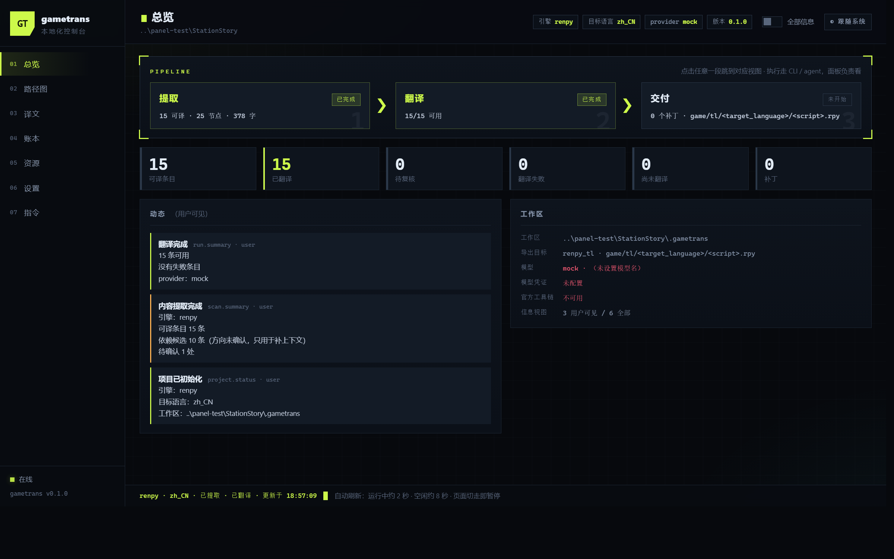
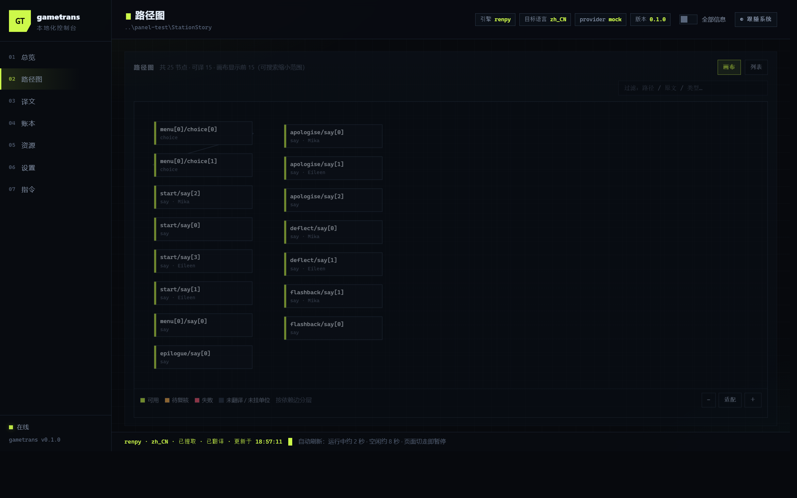
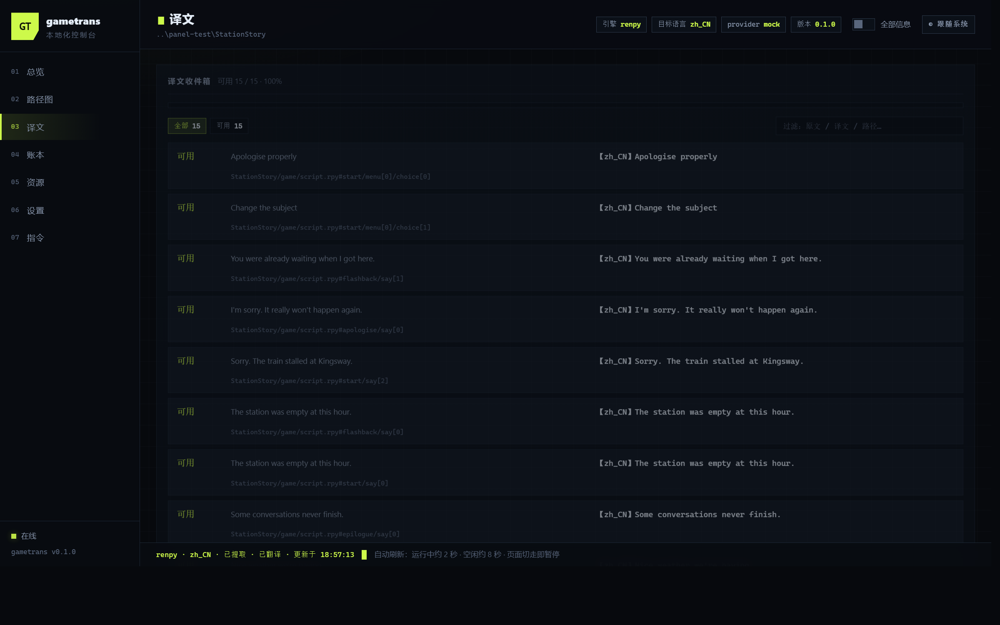

<p align="center">
  
</p>

<h1 align="center">GameTrans</h1>

<p align="center">
  <b>AI 驱动的游戏翻译工作台</b><br>
  引擎无关的五层内核 · CLI 与 MCP 双控制面 · 只监听本机的面板
</p>

<p align="center">
  
  
  
</p>

**GameTrans 把一款 Ren'Py / RPG Maker MV 游戏，整本翻成可玩的中文版**——从一个游戏文件夹开始，到装回游戏就能玩的中文补丁，中间不需要你懂编程，也不需要懂汉化：活儿由你电脑上的 AI agent（Codex、Claude Code 都行）替你干，翻译接口用你自己的 key。

你也不用盯着黑窗口。翻译的全过程在一个**只运行在你电脑上的面板**里看得见、改得动：人名术语统一管理，AI 不会各叫各的；游戏里的特殊格式（占位符、控制符）有校验把着，翻坏了进不了游戏；游戏文件本身只读，产物是一个单独的中文补丁，装不装、什么时候装都由你。

当前支持 **Ren'Py** 与 **RPG Maker MV**。

> **GameTrans** turns a Ren'Py / RPG Maker MV game into a playable Chinese version, end to end: game folder in, an installable Chinese patch out — no coding or translation-patching experience needed. Your own AI agent (Codex, Claude Code, …) does the work against your own translation API key, while a local-only panel keeps every sentence visible and editable, with term consistency and format validation built in. Game files are only read; the patch is a separate artifact you apply when you choose to.



---

## 五步上手

**① 装软件** —— 到 [Releases](https://github.com/Drhushi/GameTrans/releases) 下载：Windows 用**安装器**（双击装好，开始菜单有快捷方式）或**便携版 zip**（解压即用）；macOS / Linux 走源码，见下面「安装」。

**② 打开一个游戏** —— 启动 GameTrans，把游戏文件夹拖进来（或在面板里选目录）。它会在游戏目录旁建一个工作区，游戏文件本身只读，不会被改动。

**③ 接上你的 AI agent** —— 面板是看现场的地方，真正干活的是你电脑上的 AI agent。打开 设置 → **AI agent** 卡，复制那里的 MCP 配置，接到你的 agent 上（Codex、Claude Code 都行，卡里有它们各自的接法；还没有 agent 就照卡里的链接装一个）。接好之后，agent 就能直接调用「扫描 / 翻译 / 写回 / 封包」这些工具。

**④ 配翻译接口** —— 设置 → **模型接入**，填一个 OpenAI 兼容服务的接口地址与 API Key（DeepSeek、火山方舟、本地 Ollama……都行）。翻译花的是你自己的 key，不经过任何中间人。

**⑤ 开翻，然后玩** —— 把这句话发给你的 agent：

> 用 gametrans 把 `<游戏路径>` 翻成中文：scan → translate → writeback → pack，翻完封补丁。

agent 会自己调工具干活；面板上看得到每一句的原文译文、进度与花销。跑完把补丁装进游戏：**RPG Maker MV** 装完在游戏内「设置」里会多一行「Language / 语言」；**Ren'Py** 的补丁解压进游戏目录即生效，语言切换入口看游戏自己的设置页。翻得不满意的句子，在面板的「译文」页逐句改完再重新封包。

---

## 给 AI agent 用

GameTrans 的每个动作都返回**结构化结果**与**结构化错误**（带 `message` 与 `hint`），
所以 agent 不需要解析人类可读的日志，也不会拿到一句「失败了」却不知道下一步做什么。

### 接入 MCP

任何支持 MCP 的 agent 都按同一份 stdio 配置接入。

**源码运行**（自备 Python）：`cwd` 必须是 GameTrans 的检出目录（它靠这个找到模块，
不需要 pip 安装）：

```json
{
  "mcpServers": {
    "gametrans": {
      "command": "python",
      "args": ["-m", "gametrans", "mcp"],
      "cwd": "/path/to/GameTrans"
    }
  }
}
```

**Windows 免安装版**：exe 本身就是 MCP 服务，不用 Python——把路径换成 `GameTrans.exe`、
参数换成 `["mcp"]` 即可；面板 设置 → AI agent 卡里是按你的安装路径生成好的配置，一键复制：

```json
{
  "mcpServers": {
    "gametrans": {
      "command": "C:/Program Files/GameTrans/GameTrans.exe",
      "args": ["mcp"]
    }
  }
}
```

两家常见 agent 的现成接法：Codex 写 `~/.codex/config.toml` 的 `[mcp_servers.gametrans]` 表
（形状同上）或 `codex mcp add gametrans -- <命令> <参数>`；Claude Code 用
`claude mcp add --scope user gametrans -- <命令> <参数>`（Windows 路径用正斜杠，它吃反斜杠）。

**项目路径通过工具参数传，不是通过命令行。** 每次调用带上 `project`
（以及可选的 `workdir`）——`tools/list` 给出的 schema 里已经写明这两个参数，
agent 自己就能发现：

```json
{ "name": "scan", "arguments": { "project": "/path/to/MyGame" } }
```

### 一次典型调度

```
scan                      → 带权路径图：哪些文本要翻、各自多重要、锚在引擎的哪一行
plan                      → 这一次会按什么顺序跑：区域、前驱集、最少要跑几轮
tasks                     → 看任务状态机现在到哪（DISCOVERED → READY → TRANSLATING → …）
translate --batch-size 20 → 分批翻译；单条失败只记进报告，不中断整批
writeback                 → 填回产物骨架（默认只填空缺，不动里面已有的译文）
pack                      → 封成可分发补丁
```

不接 MCP、直接用 CLI 也可以（agent 挑顺手的就行）：

```bash
# 一次初始化（引擎自动探测）
python -m gametrans --project /path/to/MyGame project init --target-language zh_CN

# 五步走完
python -m gametrans --project /path/to/MyGame scan
python -m gametrans --project /path/to/MyGame translate --provider mock   # 先空跑，不花钱
python -m gametrans --project /path/to/MyGame writeback
python -m gametrans --project /path/to/MyGame pack
python -m gametrans --project /path/to/MyGame web                        # 想用眼睛看

# writeback 默认只填空缺：产物里已有的译文一个字不动。
# 确实要用当前译文覆盖那些位置，得显式声明这一项：
python -m gametrans --project /path/to/MyGame writeback --overwrite-existing

# 游戏可以不在仓库里：工作区搬到别处，游戏目录全程只被读
python -m gametrans --project /path/to/MyGame --workdir ./work/mygame scan
```

翻译接口的凭据走环境变量或面板（设置 → 模型接入），CLI 不经手：

```bash
export GAMETRANS_API_KEY=sk-...
export GAMETRANS_BASE_URL=https://api.deepseek.com/v1
export GAMETRANS_MODEL=deepseek-chat

python -m gametrans --project /path/to/MyGame translate --provider openai --batch-size 10
```

任何讲 OpenAI `/chat/completions` 协议的服务都能直接用（火山方舟、DeepSeek、
本地 vLLM / Ollama……）。另有 `--provider agent`：不接 API，而是把请求落成**挂单**，
由 agent 会话用自己的额度作答（`agent next` 取单、`agent submit` 交回）——
答案和 API 响应走**同一条**解析与校验链，判据一条不少。

配置分四层，换游戏不用重配接入信息：

```
环境变量  >  项目配置（<工作区>/project.json）  >  全局默认（~/.gametrans/）  >  出厂默认
```

`--json` 让每条命令输出结构化结果，错误也带 `hint`。出问题时 agent 有得可查，而不是只能重试：`ir` 导出并校验提取层一致性、
`staleness` 点名该重做的译文（过期 / 缺失 / 不可用分开报）、`tasks --ref <id>`
看某一条任务的完整载荷与检索结果、`revalidate` 按当前判据重新裁定当初被挡下的译文。

**CLI 与 MCP 是同一套东西的两张皮**：两者共用一个操作注册表，所以「每个操作都有对应的
MCP 工具」是构造出来的性质，不会随开发漂移（`mcp` / `web` 是传输入口，不在注册表里）。

---

## 安装

### 免安装 exe（不需要 Python，Windows 推荐）

从 [Releases](https://github.com/Drhushi/GameTrans/releases) 下载，二选一：

* **便携版** `GameTrans-x.y.z-portable.zip`：解压到任意可写目录，双击里面的 `GameTrans.exe`
* **安装器** `GameTrans-setup-x.y.z.exe`：装进开始菜单，带桌面快捷方式与卸载器；
  装新版直接覆盖（数据不在安装目录，升级不丢）

首次打开面板会带你走一遍新手教程（之后随时可以在 设置 → 界面 → 重看新手教程 找回）；
设置页还能一键「检查更新」。装好后的用法照上面「五步上手」走。

### 源码运行（自备 Python ≥ 3.11）

下载源码 Release 包解压，然后：

* **Windows**：双击 `打开面板.bat`（也可以把游戏文件夹**拖到**它上面）
* **macOS / Linux**：`python3 scripts/open_panel.py`

它会自动探测引擎、在游戏目录里建工作区、挑一个空闲端口起面板，然后开界面 ——
**优先独立窗口**：装了 PySide6 就开多标签桌面壳，装了 pywebview 就开单窗口，两样都没有才
退回浏览器（都不装不影响任何功能）。多个游戏的面板可以同时开着，互不抢占端口。

---

## 面板



**六页**，页名就是它管的那件事：

| 页 | 看什么 |
|---|---|
| **总览** | 流水线走到哪、关键指标、动态流、每轮花销与运行记录 |
| **路径图** | 带权依赖图：有依赖边就按边分层画 DAG，列表兜底。节点上写的是**这一场能读到的剧情文字**，代码侧的路径只进 tooltip |
| **译文** | **一行一场戏**（一个单元）：点开是逐句原文/译文，以及碰过它的请求 |
| **资源** | 术语书（一行一个实体：写法 + 各自的译名 + 事实列表）、待审更正、风格指南 |
| **请求** | 请求台账（真发出去的与只拦下来的，按正文指纹对上号）+ 请求模板：模板里的预览走的是**生产那条装配路径**，看到的就是会发出去的 |
| **设置** | 项目目录、界面（主题 / agent 视图 / 新手教程）、模型接入与凭证、翻译配置、引擎 SDK、指令参考 |

**新手教程**：首次打开自动放一遍（高亮逐步引导），设置页里可以随时重看。
界面上有一个 **agent 视图**开关：关着时只显示你该看的，打开才展开对 agent 透明的那些
（开关状态记在本机）。



**能在这里改的**：模型接入与凭证（API Key 只显示尾 4 位）、翻译配置、引擎 SDK 路径、
术语书与风格指南（增删改）、待审更正（采纳 / 驳回）、单条译文（逐句改）。
手改译文走的是和 `translate`、`writeback` **同一道结构校验闸门**——占位符、标签、控制码
对不上就存成「待复核」且不会写回。

**不在这里做的**：扫描、翻译、写回、封包。它们是长任务，要进度、要中断、要回滚，
所以只在 CLI 或 MCP 上跑；面板对它们的请求返回 `501` 并告诉你该用哪条命令。
这是**刻意的分工**，不是没做完。

---

## 手里已经有译文

很多译者是在一份**已经有人翻过一部分**的游戏上接着做。那部分译文是资产，不是待办：
先把它读进来（**只读游戏目录**），你拿到三样东西——

```bash
python -m gametrans --project /path/to/MyGame --workdir ./work/mygame resource harvest
```

* **一份带账的现状**：对白块与字符串表各多少条、配上多少、空位多少、与原文一字不差的
  多少。两个恒等式直接摆在报告里 —— 数字对不上就说明有东西没被报出来；
* **翻译记忆**：配上的对应按原文收进句子库（记为 `imported`），作为资产留在工作区；
* **孤儿译文**：游戏更新后哪些旧译文已经对不上当前内容 —— 这件事只有引擎自己
  （官方 `lint`）算得出来，连着原文与译文一起给你。

⚠️ 这条通道**不产术语候选**：观察出来的对应只进翻译记忆。术语书该由"这一场里谁登场、
哪些名字要定译"来产，不是由"这句话出现了两次"来产。

要让它们**直接顶替这次翻译、不重问模型**，加一个声明：

```bash
python -m gametrans --project /path/to/MyGame --workdir ./work/mygame translate --reuse-imported
```

默认不认它们——别人的成品证明不了自己是在你当前的术语/风格状态下翻的。声明之后才放行，
而且只放行这一种来源：我们自己翻的译文一旦知识状态变过，照样算过期。复用来的每条**仍然
要过结构校验**（违例的进「待复核」，不会写回），记录里也留着来源，报告里
`memory_imported_hits` 就是"这次有多少条是别人的成品"。

---

## 能做到什么

|  | Ren'Py | RPG Maker MV |
|---|---|---|
| **内容范围由谁定** | 官方骨架（`renpy <工程> translate <语言>`） | 适配层按引擎数据结构申报 |
| **结构从哪来** | 读源码（label / 菜单 / jump / call） | 引擎数据里的路径即身份 |
| **写回产物** | 填进官方骨架，产出 `game/tl/<语言>/` | 运行时插件那一套，解压覆盖到 `www/` |
| **封包** | zip 补丁 | zip 补丁 |
| **前置条件** | 需要先有官方骨架，或填好 SDK 路径 | **无**，不需要任何外部工具链 |
| **游戏目录被动过吗** | 提取只读；**写回把译文填进 `game/tl/<语言>/`**（Ren'Py 的产物本来就该是游戏的一部分） | 全程不动：产物是补丁，解压覆盖是你自己的动作 |

RPG Maker MV 那条路：装完进游戏的**设置**里会多一行 `Language / 语言`，
选中按确定或左右键切换，选择存进 `config.rpgsave`。（目前只适配 **RPG Maker MV**，
MZ 还没有；Ren'Py 需要先有官方语言骨架或配好官方 SDK——没有的话，命令会在开工前报错
并说明怎么补，不会按源码瞎猜。）

---

## 运行要求

* **免安装版**：Windows 10 及以上，不需要 Python
* **源码运行**：Python ≥ 3.11，零第三方依赖（只用标准库）；Windows 双击 `打开面板.bat`，macOS / Linux `python3 scripts/open_panel.py`
* 面板只监听 `127.0.0.1`，不对外暴露，不上传任何游戏内容

---

## 许可

[GPL-3.0-or-later](LICENSE)。

你可以自由使用、修改、分发，也可以用它提供服务并收费；但如果**分发**基于它的衍生作品，
必须同样以 GPL-3.0 开源。这是为了挡住「改一改就当成自己的闭源产品发出去」。

随包代码里有一处第三方算法：RPG Maker MV 适配层的 LZString 实现还原自
[lz-string](https://github.com/pieroxy/lz-string)（作者 Pieroxy，**MIT 许可**），
署名与许可声明保留在 `gametrans/engines/rpgm/lzstring.py` 的文件头。
